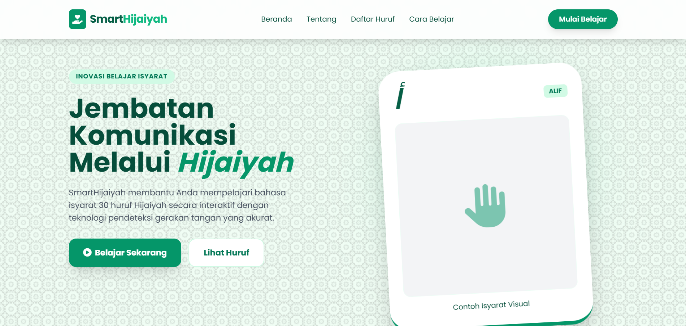
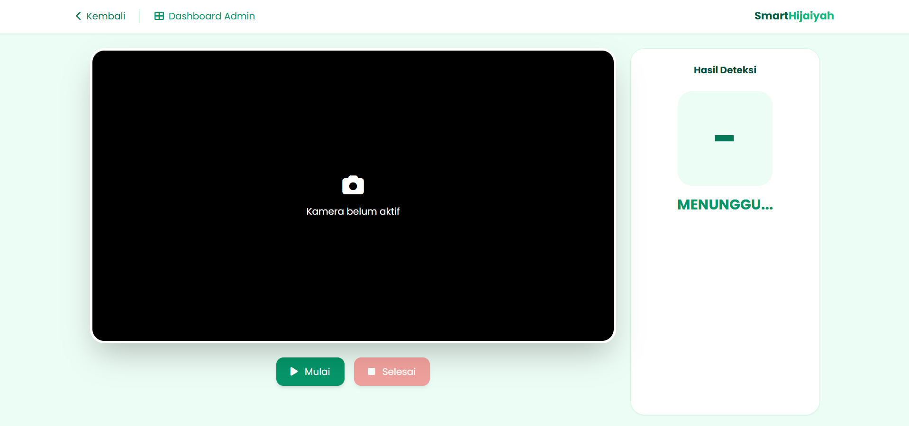
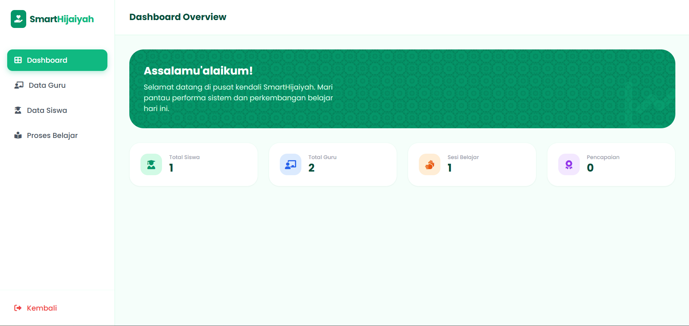
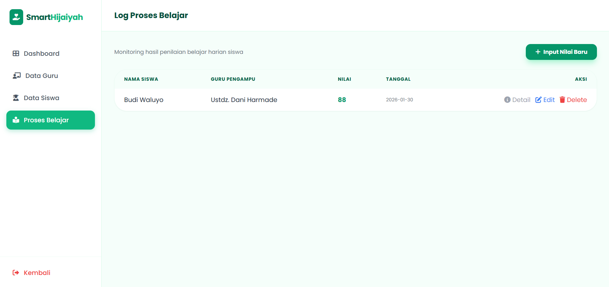
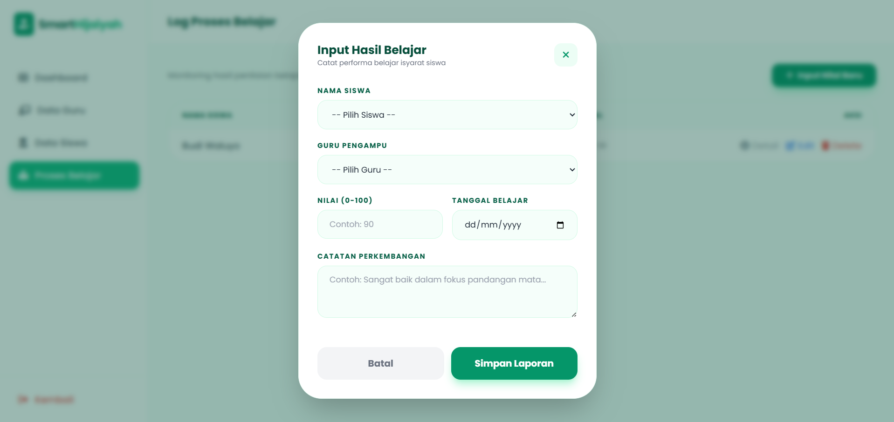

# SmartHijaiyah – Website Interaktif Belajar Huruf Hijaiyah

SmartHijaiyah adalah platform web interaktif berbasis Artificial Intelligence yang dirancang untuk membantu pengguna mempelajari huruf Hijaiyah melalui deteksi gerakan tangan secara real-time menggunakan kamera web dan teknologi Computer Vision.

---

## 📸 Preview Tampilan

### 🏠 Halaman Beranda
<p align="center">
  
</p>

### 🎓 Halaman Belajar
<p align="center">
  
</p>

### 🎓 Halaman Dashboard
<p align="center">
  
</p>

### 🎓 Halaman Proses Belajar
<p align="center">
  
</p>

### 🎓 Halaman Input Proses Belajar
<p align="center">
  
</p>


## 🌟 Deskripsi Singkat

Proyek ini menyediakan media pembelajaran huruf Hijaiyah yang modern, interaktif, dan mudah diakses. Pengguna dapat mempraktikkan gerakan isyarat huruf Hijaiyah di depan kamera, dan sistem akan memberikan hasil prediksi secara langsung menggunakan model Machine Learning.

Website ini dikembangkan sebagai implementasi Computer Vision dan Supervised Learning dalam bidang edukasi berbasis AI.

---

## ✨ Fitur Utama

- 📖 Pembelajaran Huruf Hijaiyah Interaktif  
- 🎥 Deteksi Gerakan Tangan Real-time  
- 🤖 Klasifikasi Huruf Menggunakan Random Forest  
- 🔴 Indikator LIVE Kamera  
- 📝 Menampilkan Huruf Latin dan Arab  
- ✋ Mendukung Deteksi 1 atau 2 Tangan  
- 📱 Desain Responsif (Desktop & Mobile)  
- ❓ FAQ dan Panduan Penggunaan  
- 🖥️ URL Lokal Ditampilkan Saat Aplikasi Dijalankan  

---

## 🛠️ Teknologi yang Digunakan

### Backend
- Python 3.x
- Flask

### Computer Vision
- OpenCV
- MediaPipe (Hand Landmark Detection)

### Machine Learning
- Scikit-learn (Random Forest Classifier)
- NumPy
- Pickle

### Frontend
- HTML5
- CSS3
- JavaScript
- Bootstrap / Tailwind CSS

### Library Tambahan
- Pillow
- arabic-reshaper
- python-bidi

---

## 📁 Struktur Proyek

```
SmartHijaiyah/
├── app.py
├── model/
│   └── model_rf1.p
├── static/
│   ├── css/
│   ├── js/
│   ├── img/
│   │   └── hijaiyah/
│   │       ├── alif.jpg
│   │       ├── ba.jpg
│   │       └── ...
├── templates/
│   ├── index.html
│   └── belajar.html
└── requirements.txt
```

---

## 🚀 Setup dan Instalasi

### 1. Prasyarat
- Python 3.7 atau lebih baru
- pip
- Webcam aktif

### 2. Buat Virtual Environment (Opsional tapi disarankan)

```bash
python -m venv venv
```

Aktifkan:

Windows:
```bash
venv\Scripts\activate
```

Mac/Linux:
```bash
source venv/bin/activate
```

### 3. Install Dependencies

Buat file `requirements.txt`:

```
Flask
opencv-python
mediapipe
numpy
scikit-learn==1.0.2
Pillow
arabic-reshaper
python-bidi
```

Install:

```bash
pip install -r requirements.txt
```

### 4. Jalankan Aplikasi

```bash
python app.py
```

Buka di browser:

```
http://127.0.0.1:5000/
```

---

## 📖 Cara Penggunaan

1. Jalankan aplikasi.
2. Buka halaman **Belajar**.
3. Klik tombol **Mulai Kamera**.
4. Izinkan akses kamera.
5. Lakukan gerakan huruf Hijaiyah di depan kamera.
6. Sistem akan menampilkan:
   - Huruf Latin
   - Huruf Arab
   - Status LIVE 🔴

Klik **Stop Kamera** untuk menghentikan sesi.

---

## 🧠 Informasi Model Machine Learning

- Model: Random Forest Classifier  
- Input: 84 fitur (2 tangan × 21 landmark × 2 koordinat)  
- Jika hanya 1 tangan terdeteksi → sistem melakukan padding 42 fitur  
- Landmark dinormalisasi agar stabil terhadap posisi dan skala  

---

## ⚠️ Troubleshooting

### Kamera Tidak Muncul
- Pastikan tidak ada aplikasi lain menggunakan kamera.
- Periksa izin akses kamera di browser.
- Restart aplikasi.

### Prediksi Tidak Akurat
- Gunakan pencahayaan yang cukup.
- Pastikan tangan terlihat jelas.
- Hindari latar belakang yang terlalu ramai.
- Jangan bergerak terlalu cepat.

---

## 🎓 Tujuan Pengembangan

- Media pembelajaran huruf Hijaiyah berbasis AI  
- Implementasi Computer Vision  
- Implementasi Supervised Learning  
- Proyek penelitian / tugas akhir  

---

## 🙌 Kontribusi

Masukan dan saran sangat terbuka untuk pengembangan lebih lanjut.

---

## 📜 Lisensi

Proyek ini bersifat open-source.  
Detail lisensi akan ditambahkan pada pembaruan berikutnya.

---

## 🙏 Ucapan Terima Kasih

Terima kasih kepada:
- Flask
- OpenCV
- MediaPipe
- Scikit-learn
- Komunitas Open Source
